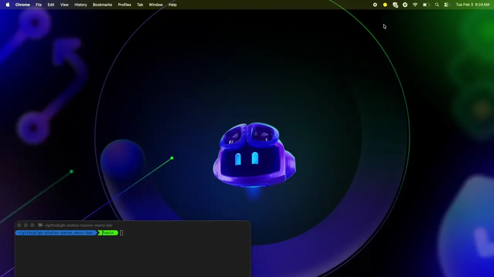

# GitHub Status Bar

A native macOS menu bar app that monitors GitHub's service status in real-time.

Built using [GitHub Copilot CLI](https://github.com/features/copilot/cli) for the [GitHub Copilot CLI Challenge](https://dev.to/leereilly/is-github-having-a-good-day-a-macos-menu-bar-app-built-with-copilot-cli-2d8k).




## Features

- 🟢 **Real-time Status** - Colored menu bar icon shows GitHub's current status
  - Green = All systems operational
  - Yellow = Minor service outage / degraded performance
  - Red = Major outage
- 📋 **Detailed View** - Click to see affected components and active incidents
- 🔔 **Notifications** - Get notified when GitHub's status changes
- 🚀 **Launch at Login** - Optionally start automatically when you log in
- ⚡ **Lightweight** - Native SwiftUI app with minimal resource usage

## Screenshots

The app displays a colored circle in your menu bar:

| Status | Icon |
|--------|------|
| All Systems Operational | 🟢 |
| Minor Outage | 🟡 |
| Major Outage | 🔴 |

## Requirements

- macOS 13.0 (Ventura) or later
- Xcode 15.0+ (for building)

## Installation

### Homebrew

```
brew tap leereilly/github-status-bar
brew install --cask github-status-bar
```

### From Source

1. Clone the repository:
   ```bash
   git clone https://github.com/yourusername/gh-status-macos-menu-bar.git
   cd gh-status-macos-menu-bar
   ```

2. Open in Xcode:
   ```bash
   open GitHubStatusBar.xcodeproj
   ```

3. Build and run (⌘R)

### Building for Release

1. In Xcode, select **Product → Archive**
2. In the Organizer, click **Distribute App**
3. Choose **Copy App** to export the `.app` bundle
4. Move `GitHubStatusBar.app` to `/Applications`

## Usage

Once running, the app appears as a small colored circle in your menu bar.

- **Click** the icon to see:
  - Current status summary
  - Active incidents with details
  - Affected services
  - All service statuses
  
- **Refresh Now** - Manually refresh the status
- **Open githubstatus.com** - View the full status page
- **Launch at Login** - Toggle automatic startup
- **Quit** - Close the app

## Configuration

The app refreshes every **60 seconds** by default. This is configured in `StatusManager.swift`:

```swift
private let refreshInterval: TimeInterval = 60
```

## Architecture

```
GitHubStatusBar/
├── GitHubStatusBarApp.swift      # Main app entry point with MenuBarExtra
├── Models/
│   ├── GitHubStatus.swift        # API response models (Codable)
│   └── StatusIndicator.swift     # Status enums with colors
├── Services/
│   ├── GitHubStatusService.swift # Network layer (async/await)
│   └── StatusManager.swift       # State management (@MainActor)
├── Views/
│   ├── StatusMenuView.swift      # Dropdown menu content
│   └── ComponentRowView.swift    # Component/incident rows
├── Assets.xcassets/              # App icon
├── Info.plist                    # LSUIElement = YES (menu bar only)
└── GitHubStatusBar.entitlements  # App sandbox + network client
```

## API

The app uses GitHub's public Status API:

- `https://www.githubstatus.com/api/v2/status.json` - Overall status
- `https://www.githubstatus.com/api/v2/summary.json` - Components + incidents

No authentication required.

## Privacy

- ✅ No data collection
- ✅ No analytics
- ✅ Only connects to `githubstatus.com`
- ✅ Sandboxed with minimal permissions

## License

MIT License - see [LICENSE](LICENSE) for details.

## Contributing

Contributions welcome! Please open an issue or pull request.

## Acknowledgments

- Uses GitHub's public [Statuspage API](https://www.githubstatus.com/api)
- Built with SwiftUI and the `MenuBarExtra` API
